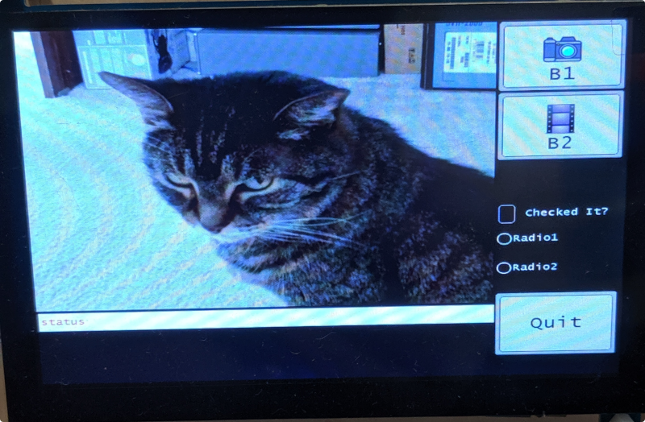

# tiger_gl - General graphical library for RPI

The tiger_gl library does not use X11, it writes directly to the Linux framebuffer.

This library was inspired by the **[Littlevgl](https://github.com/littlevgl)** and **[UGUI](https://github.com/achimdoebler/UGUI)** libraries which are very good libraries.

Currently this library has the features I need for my projects but I will add new features as needed.  If yow have a need for a new feature or added a new feature to **tiger_gl** send an email to **rkwiles@twc.com** and let me know.

### Tiger_gl Features:

	- No X11 required.
	- Simple to use.
	- All code is in C.
	- Develop for Raspberry PI
	- Image Widget
	- Label Widget
	- Checkbox widget
	- Radio buttons with grouping
	- Touch screen support
	- Many simple font sizes
	- Support for video
	- Auto updating screen. (Only draws what has changed)

The **tiger_gl** library uses two screen buffers. The first screen area is what the **tiger_gl** library updates.  The second screen is the linux frame buffer which is automatically updated from the first screen.  I only update what has changed from the first screen to the linux frame buffer, cutting down on the memory copies.

### Files and API

The library is divdied up into groups:

	- General screen functions. (screen_gl.c)
	- Primartive drawing functions. (draw_gl.c)
	- Main library functions. (tiger_gl.c)
	- Touch screen functions. (touch_gl.c)
	- Widget fucntions. (widget_gl.c)
	- Ugui functions. (ugui.c) I am using the primative drawing and font functions of ugui.

#### Tiger_gl API

Function | Description
-------- | -----------
int tglInit(char *device, int width, int height) | First call to initialize the tiger_gl library.
int tglFbOpen(char *device) | Opens the linux frame buffer device.  Normally called by the tglIint function.
void tglSetAutoUpdate(int flag) | Enables or disable auto updating.
void tglFbPrintInfo(void) | Prints information about FB.
void tglFbClose(void) | Restores screen and closes the frame buffer device.
unsigned char *tglFbGetFbp(void) | Returns the linux frame buffer pointer to memory.
int tglFbGetWidth(void) | Returns the screens width in pixels.
int tglFbGetHeight(void) | Returns the screens height in pixels.
int tglFbGetBpp(void) | Returns the screens bits per pixel. (always 32 bits)
void tglFbUpdate(void) | Updates the complete screen, normally only called by the tiger_gl library.
void tglFbUpdateArea(unsigned char *buf, int bx, int by, int bw, int bh) | Updates a rectangle area on the screen. Normally called by the update thread.
void tglFindTouchDevice(char *deviceName) | Use the lsinput program to find the touch screen device.  Currently supports 3 screen types, see code for screens.

Function | Description
-------- | -----------
tglScreenCreate | Used to create the first screen.
tglScreenLoad | Used to load a screen image directly to the screen.
tglScreenSave | Save the current screen to an image file.
tglScreeDelete | Deletes the screen. Not normally called.
tglScreengetBitmap | Returns the screen image as a pointer to TGLBITMAP.
tglScreeGetPixels | Returns the pointer to the screem image pixels.
tglScreengetScanLine | Returns a pointer to the row given.
tglScreenGetType | Returns the image type of the screen.
tglScreenGetColorsUsed | Returns the number of colors used.
tglScreenGetBpp | Returns pointer to screen image.
tglScreenGetWidth | Returns screen width in pixels.
tglScreenGetHeight | Returns screen height in pixels.
tglScreenGetPitch | Returns width of screen in bytes rounded to the next 32 bit boundary.
tglScreenRotate | Rotate screen by angle.
tglScreenFlipHorizontal | Flips screen horizontal
tglScreenFlipVertical | Flips screen vertical
tglScreenGetSize | Returns the size of the DIB-element
tglScreenRescale | Rescales the image.
tglScreenPrintInfo | Print screen information.
tglScreenPutPixel | Called by all functons needing to draw something to the screen.
tglScreePutChar | Draws a single characrter to the screen.
tglScreePutString | Draws a string of characrters to the screen.
tglScreenFill | fills screen with a color.

Function | Description
-------- | -----------
tglDrawLine | Draws a line on the screen.
tglDrawRect | Draws a rectangle on the screen.
tglDrawRoudRect | Draws a rounded rectangle on the screen.
tglDrawFillRect | Draws a filled rectanlge on the screen.
tglDrawFillRoudRect | Draws a filled rounded rectangle on the screen.
tglDrawCircle | Draws a circle on the screen.
tglDrawFillCircle | Draws a filled circle on the screen.
tglDrawMeshRect | Draws a meshed rectangle on the screen.
tglDrawArc | Draws a arc on the screen.
tglDrawImage | Draws an image to the screen with ot without transparency.
tglDrawVideoImage | Used to support drawing frames of video to the screen.

Function | Description
-------- | -----------
tglImageCreate | Allocate an image in memory.
tglImageLoad | Load an image into memory.
tglImageSetTransparent | Set an image to support tranparency.
tglImageSetTransTable | Set images transparency table.
tglImageGetBg | Get images background color.
tglImageLoadMem | Load an image from memory.
tglImageSave | Save an image to disk.
tglImageDelete | Delete an image in memory.
tglImageSaveRaw | Save image to disk in raw format.
tglImageComposite | Adds a composite to the image.
tglImageClone | Clone an image.
tglImageGetScanLine | Get pointer to image row.
tglImageGetBits | Get pointer to image data.
tglImageGetBPP | Get images bit per pixel.
tglImageGetType | Get image type.
tglImageGetColorsUsed | Get number of colors used by image.
tglImageGetWidth | Get width of image.
tglImageGetHeight | Get height of image.
tglImageGetPitch | Get pitch of image.
tglImageGetLine | Get scan line size in bytes.
tglImageRotate | Rotate image by angle.
tglImageFlipHorizontal | Flip image horizontal
tglImageFlipVertical | Flip image vertical
tglImageGetSize | Get size of image.
tglImageRescale | Rescale image.
tglImageConvertTo32 | Convert image to 32 bpp
tglImagerPrintInfo | Print information about image. Normally called by tiger_gl library.
tglTouchGetEvent | Gets the next touch eventi.  Normally called but touch thread.

Function | Description
-------- | -----------
tglTouchInit | Noramlly called by tglInit()

Function | Description
-------- | -----------
tglWidgetRegister | A #define which calls the tglWidgetRegisterV function.
tglWidgetRegisterV | Registers widgets and calls their paint routines.  Use tglWidgetRegister function instead.
tglWidgetSetData | Sets data for a widget, used by the programmer to pass data.
tglWidgetGetData | Retrives the data of a widget.
tglWidgetEvent | Used by the touch thread to notify a widget of an event.
tglWidgetDelete | Deletes a widget.
tglWidgetImage | Create an image widget.
tglWidgetAddCallback | Adds a callback to the widget. see example program tiger_gl-test
tglWidgetAddIcon | Add an Icon to the widget if it supports it.
tglWidgetSetFont | Set the font used by a widget.
tglWidgetSetFgColor | Set foreground color of widget.
tglWidgetSetFgColor | Set background color of widget.
tglWidgetSetFgBgColor | Set foreground and background colors of widget.
tglWidgetSetButtonText | Set the text of the button widget.
tglWidgetButton | Create a button widget.
tglWidgetSetLabelText | Set text of a label widget.
tglWidgetLabel | Create a label widget.
tglWidgetCheckbox | Create a checkbox widget.
tglWidgetSetCheckboxText | Set the text of the checkbox widget.
tglWidgetRadio | Create a radio button.
tglWidgetSetRadioText | Set text of a radio button.
tglWidgetSetradioGroup | Set radio button group id.
tglWidgetSetSelected | Set widget as selected.

### Building library

On a Raspberry Pi, should run on any version, you will need to install the following libraries and programs.

	- sudo apt-get install input-utils
	- sudo apt-get install libfreeimage3 libfreeimage-dev
	- sudo apt-get install libpng-dev
	- sudo apt-get install evtest

You will also need to install the **[utils](https://github.com/tigerkelly/utils)** library.  (see that repository for install instructions.)

A test program has been written **[tiger_gl-test](https://github.com/tigerkelly/tiger_gl-test)**

Once installed you should be able to type **make** to build the library.

I have only tested this on a Raspberry Pi using the NOOBS default OS.
